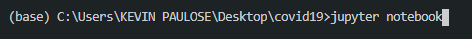
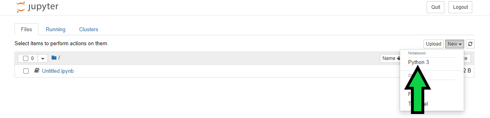
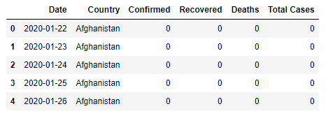
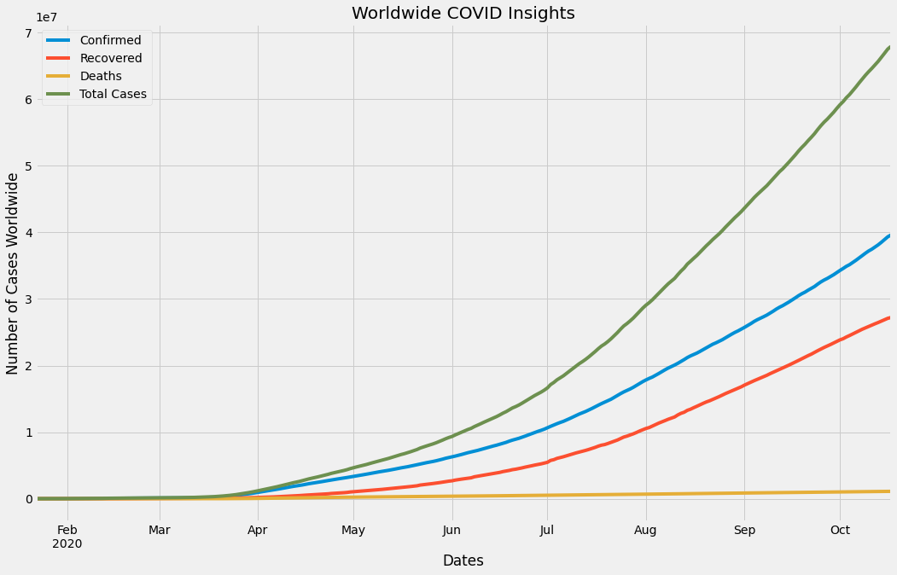
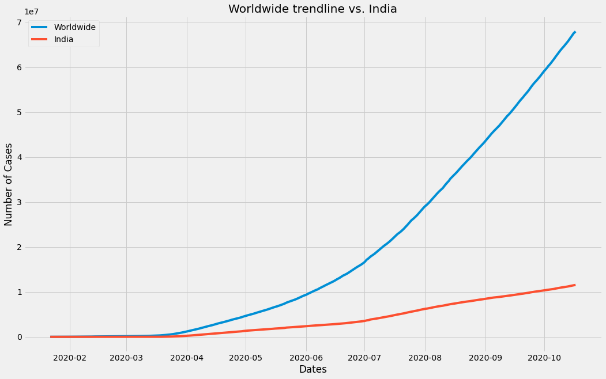
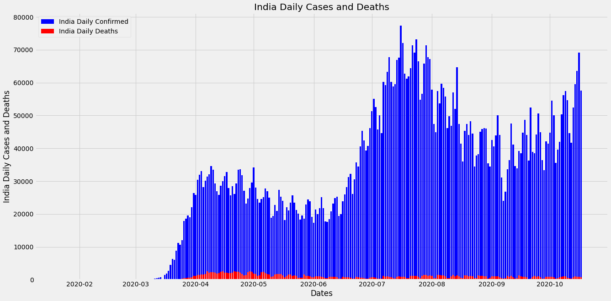
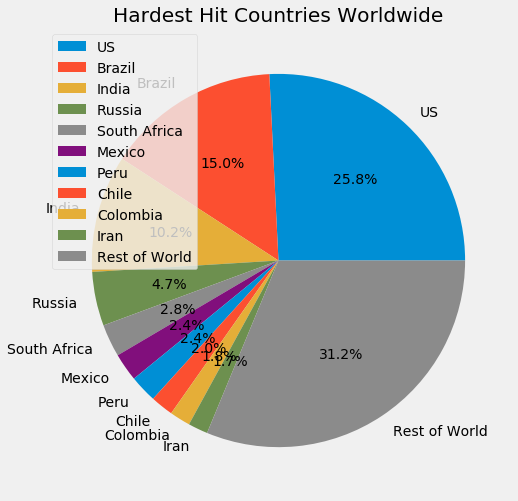

# Introduction

As we all are experiencing, the corona virus i.e. COVID-19 virus has affected people all around the globe today. We keep seeing articles describing how is the trend of confirmed cases,recovered cases and deaths in different countries. So i have made this simple project using some python libraries to visualise the effect of COVID-19 globally.

Visualization or visualisation is any technique for creating images, diagrams, or animations to communicate a message.

In this microbyte we will use [pandas](https://pandas.pydata.org/) and [matplotlib](https://matplotlib.org/) python libraries to depict the trend of COVID-19 using various plot comparisons.

# Prerequisites

For this micro-task, you should have a basic knowledge of:

- Python
- [Pandas](https://pandas.pydata.org/) (recommeded)
- [Matplotlib](https://matplotlib.org/) (recommeded)

Along with this, we will be using **Jupyter Notebooks** as our working environment. So make sure you have it configured for your pc or laptop. You can have a look at the installation instructions [here](https://test-jupyter.readthedocs.io/en/latest/install.html).

> NOTE: If after installation of python you are not able to install jupyter notebooks as aforementioned use the following command in a terminal:

            python3 -m pip install jupyter

# Activites

> NOTE: There are links for resources that can be refered to in case you aren't familiar with the concept used. So kindly check those out too.

## Optional Activity: First things first

In case you are new to data analysis using python skim through [this](https://www.youtube.com/watch?v=-Rf4fZDQ0yw&list=PLjgj6kdf_snaw8QnlhK5f3DzFDFKDU5f4) playlist.

Also real crisp [courses](https://www.kaggle.com/learn/python) if needed.

Get jupyter notebooks installed as mentioned before. [Pycharm](https://www.jetbrains.com/pycharm/) can also be used. But visualisation is generally better in jupyter notebooks.

# Activity 0: Setting up our workspace

Let's start off with this microbyte now.

Run the following command in your folder's terminal

This command starts a [kernel](https://jupyter-client.readthedocs.io/en/stable/kernels.html#:~:text=A%20'kernel'%20is%20a%20program,up%20communications%20with%20the%20frontend.) in which our notebook starts. This will redirect you to your defaul web search engine and will open the jupyter notebook online.

> NOTE: As long as you are working on the project the terminal needs to keep running,(i.e. the kernel needs to keep running). Never exit until done with notebook.

Open a python3 file and you may rename it to your choice.

 

- Reference : [Jupyter notebooks](https://www.youtube.com/watch?v=q_BzsPxwLOE)

## Activity 1: Getting Started

The data set used here in this microbyte is [this](https://raw.githubusercontent.com/datasets/covid-19/master/data/countries-aggregated.csv). This data set is being managed and is updated daily by Johns Hopkins University Center for Systems Science and Engineering.

In this activity we will be loading necessary libraries(pandas and matplotlib), reading in data and setting up some basic layout features.

TL;DR ? Let's get started- 
> Go to src/Activity_1.ipynb

The output on executing the .head() function should be something like 

 

## Activity 2 : Lets "visualize"

In this activity you will be plotting your first plot used to visualize total number of cases versus all confirmed,recovered,death counts in a single plot. 

> Go to src/Activity_2.ipynb

The ouput on executing plt.show() should be like

 

## Activity 3: Let's see how well a country is w.r.t. the world

In this activity you will be plotting a similar graph as before but here you will be seeing the trend of cases in a country as compared to the world. 

> Go to src/Activity_3.ipynb

The ouput on executing plt.show() should be like

 

## Activity 4: Let's see how well a country itself is 

In this activity you will be plotting a bar graph of Daily cases confirmed vs Daily deaths registered. This will give us the idea of how well the country is holding up in these times on a daily basis.

> Go to src/Activity_4.ipynb

The ouput on executing plt.show() should be like

 

## Activity 5: DIY Challenge

In this challenge activity you are supposed to plot a pie chart that will indicate all the worst-affected countries.

Get creative and complete this challenge.

> Submit your Activity_5.ipynb after opening an issue to this challenge

The ouput on executing plt.show() should be something like

 

HINT

         
Try sorting the data frame according to dates. Also try using the timedelta of [datetime](https://docs.python.org/3/library/datetime.html) python library. Then try arranging all in descending order. Finally plot the [pie chart](https://matplotlib.org/3.1.1/api/_as_gen/matplotlib.pyplot.pie.html).

 
 

## Dataset GitHub repo : https://github.com/datasets/covid-19
