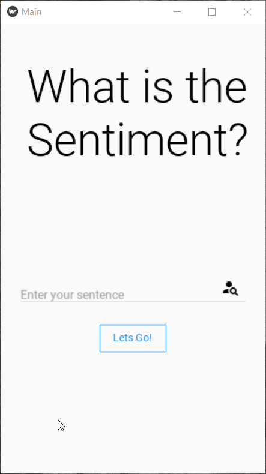

# Introduction
Python being the most popular language among developers has made its way in every domain. Whether it's web development (Flask, Django), machine learning (sklearn), Data processing (NumPy, pandas), and so on. We can make a huge list of popular frameworks and libraries which support Python. One of them is *Kivymd* which makes it possible to create cross-platform GUI based applications in Python. Though we have PyQt5 and Tkinter, they are restricted to desktop applications only. Kivymd allows you to create applications that can be deployed on IOS, Android, and Desktop. The applications created need extra steps for deployment in mobile phones. 

# Prerequisites
This micro byte assumes that you are familiar with Python programming language and have an idea of Object-Oriented Programming. Knowledge of how API returns data is a plus point though you will get a better idea when you will actually perform the activities. A bit of knowledge of android app components will make this micro-byte super easy for you.

The following things need to be installed before you start programming. In your terminal or virtual environment (if any) run the following:
```bash
pip install kivy
pip install kivymd
```
*Note: Sometimes it happens that some important kivy elements are not installed directly. To be sure, run the following command after you are done with the above two:*
```bash
pip install kivy-deps.angle
pip install kivy-deps.glew
pip install kivy-deps.gstreamer
pip install kivy-deps.sdl2
```
# Activities
Before I introduce you to the activites, have a look at what you will create after completing this microbyte:
<div align="center">

</div>

## Activity 1: Basic App structure
Kivy and Kivymd are two libraries that are used to create the above GIF you are viewing. These provide the main class which sets up the code to perform all behind the scenes of app creation and its resources. All you need to do is inherit this main class and add-on your components. What do I mean by components here?

Suppose, all of you use WhatsApp on daily basis. Just visit the app once again and notice these things:
- On the top, you have a 'WhatsApp' Title. 
- Then on the right corner you have a search option and a 3-dot menu popup.
- Then you have four navigation tabs: Chats, Status, Calls, and a Camera icon. 
- You can type your message in the input field and send it to another person.

These things are very common but they are associated with different components in an app. For example, the title is called *label*, the input field is called *text field*, the send option is called *button*, and so on. These form the basic structure of the app. Kivy makes it easier to differentiate between these components and backend processing logic. These components are designed in Kivy lang which is hierarchical in nature and codes in YAML format. Let's see the Python backend (the inherited class):
```python
from kivymd.app import MDApp

class Main(MDApp):
    def build(self):
        return <Some important variable here>

Main().run()
```
As explained earlier, the design of the components are very similar to YAML format, here is an MDLabel, which is used to display some text on the screen:
```yaml
MDLabel:
        text: 'This is a sample text'
        id: test
        pos_hint: {'center_x': 0.9, 'center_y': 0.2}
        theme_text_color: 'Custom'
        text_color: (0, 1, 0, 1)
```
This component defines that the text is 'This is a sample text', it's the id, position, and color of the text in RBG Opacity format. Here I will discuss the required components only. You can check out all the components on [kivymd documentation](https://kivymd.readthedocs.io/en/latest/components/index.html). All the components need a base screen where they can be arranged. Here is the design for the app we are targeting for these activities:
```yaml
Screen:
    MDLabel:
        text: 'What is the Sentiment?'
        font_style: 'H2'
        pos_hint: {'center_x': 0.6, 'center_y': 0.8}

    MDTextField:
        id: text
        hint_text: 'Enter your sentence' 
        pos_hint: {'center_x': 0.5, 'center_y': 0.4}
        size_hint_x: None
        width: 300
        icon_right: "account-search"
        required: True
        
    MDRectangleFlatButton:
        text: 'Lets Go!'
        pos_hint: {'center_x': 0.5, 'center_y': 0.3}
    
    MDLabel:
        text: ''
        id: show
        pos_hint: {'center_x': 0.9, 'center_y': 0.2}
        theme_text_color: 'Custom'
        text_color: (0, 1, 0, 1)
```
Here is what has been implemented:
- The base screen is the root of this design
- Under this root, we have three unique components: MDLabel, MDTextField, MDRectangleFlatButton. The label makes it possible to display text on the screen, the text field makes it possible to get input from the user and the button triggers the action to perform some task. 
- The corresponding attributes mostly common for all the components available in the library.

## Activity 2: Binding design and backend code
Now that we have the design and base code ready, let's merge them. The kivy makes it easier to process this YAML format. This format is called kivy lang in kivy and it can process by importing the kivy lang builder. Check out this code on how to merge them:
```python
from kivymd.app import MDApp
from kivy.lang import Builder

kv = """
Screen:
    in_class: text
    MDLabel:
        text: 'What is the Sentiment?'
        font_style: 'H2'
    .
    .
    """

class Main(MDApp):

    def build(self):
        return Builder.load_string(kv)

Main().run()
```
After merging this, you will be able to see the components but they won't trigger any action yet. Figured it out? The answer to this lies in the third activity.

## Activity 3: Linking Input and Output components
In the first activity, if you noticed the last component carefully, it had empty text and an id associated with it. This is done so that the results can be displayed replacing the empty text with our custom text. The id associated with the components makes it easy to access them in backend code. What we will do is that *link the id of the text field with a custom variable to be used in Python code.* This can be done using the following method:
```yaml
Screen:
    in_class: text
    MDTextField:
        id: text
        hint_text: 'Enter your sentence' 
    MDLabel:
        text: ''
        id: show
    MDRectangleFlatButton:
        on_press:
            app.sentiment()
``` 
Now in the Python code, we can access the value passed by the user using the in_class variable but it needs to be defined as ObjectProperty too in the code. For the button trigger, whenever the user presses the button, code searches for sentiment() function in-app code. See the implementation here:
```python
from kivy.properties import ObjectProperty

class Main(MDApp):
    in_class = ObjectProperty(None)
    def sentiment(self):
        # Doing something here
        pass
```

## Activity 4: Getting results from API for Input given
We are very close to complete this megabyte! For this activity, we will pass the input received to the [sentiment API](https://sentim-api.herokuapp.com/) which returns the result whether the sentence was positive, negative, or neutral. For making API calls, we will use the requests library. Make sure it is already installed (if not then run command pip install requests in terminal). The results obtained will be replaced by the placeholder empty label we made! This is how you implement this thing:
```python
class Main(MDApp):
    in_class = ObjectProperty(None)
        
    def build(self):
        return Builder.load_string(kv)

    def sentiment(self):
        sentence = self.root.in_class.text
        data = {'text': sentence}
        r = requests.post(url='https://sentim-api.herokuapp.com/api/v1/', 
                            headers={'Content-Type': "application/json", 'Accept': "application/json"},
                            json=data)
        label = self.root.ids.show
        label.text = r.json()['sentences'][0]['sentiment']['type']

Main().run()
```
As you can see I simply used the 'in_class' variable text property to obtain the text, pass it to the requests handler. After that, the result obtained is replaced with label text using that label id which is obtained by accessing it via self than in root(our screen), in ids, and finally the component id.

The app is ready to be tested!

## Activity 5: Converting the Python file to APK (optional)
If you have completed the above four activities, then congratulations you have completed this MicroByte!

This activity is for those who have well-versed experience with Linux as currently this method only works in Linux. For this conversion you need to run the following commands:
```bash
git clone https://github.com/kivy/buildozer.git

cd buildozer

sudo python setup.py install

buildozer init
```

After this, a spec file will be created. You can customize that file according to your requirements. After that run:
```bash
buildozer android debug deploy run
```
Congrats! You created an APK for your Python application. To know more about python-to-android packages, visit this [link](https://kivy.org/doc/stable/guide/packaging-android.html).

## Post Reading Material
If these micro bytes excited you to create more apps then you can check out my resources:
- [Blog Series on Medium](https://towardsdatascience.com/building-android-apps-with-python-part-1-603820bebde8) (3 part series)
- [University Results App](https://github.com/kaustubhgupta/IPUResultAndroidApp)