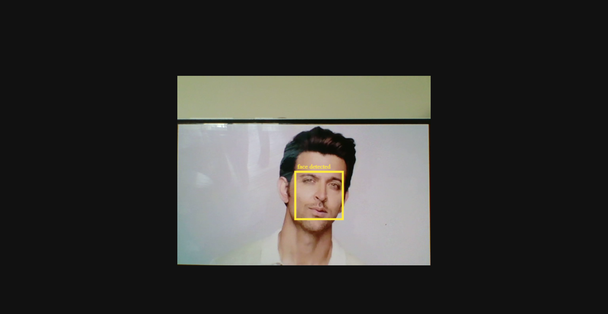
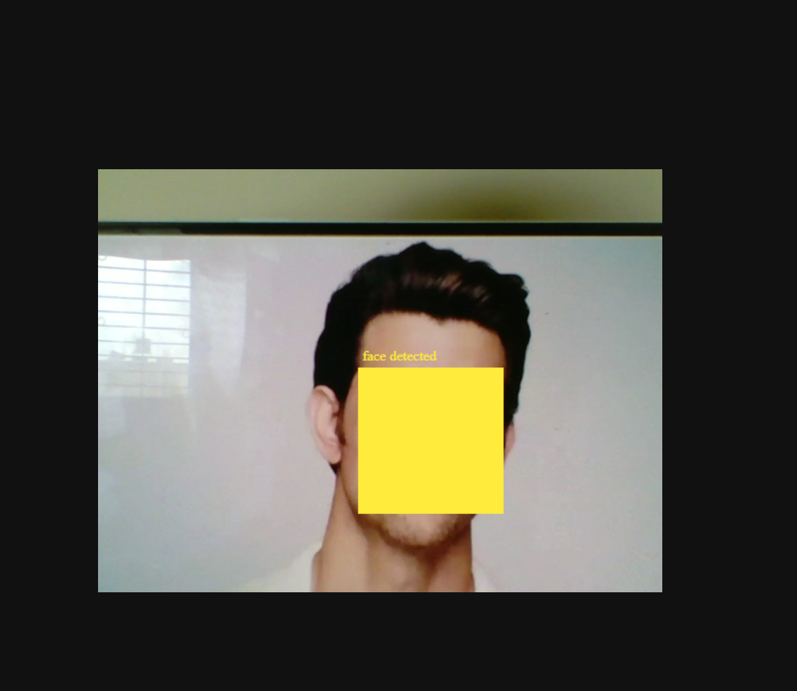

# Introduction

Photos and images constitute the largest chunk of the Web, and many include recognisable features, such as human faces, text or QR codes. Detecting these features is computationally expensive, but would lead to interesting use cases e.g. face tagging or detection of high saliency areas.

 Users interacting with WebCams or other Video Capture Devices have become accustomed to camera-like features such as the ability to focus directly on human faces on the screen of their devices. This is particularly true in the case of mobile devices, where hardware manufacturers have long been supporting these features. 
 
 Unfortunately, Web Apps do not yet have access to these hardware capabilities, which makes the use of computationally demanding libraries necessary.The Shape Detection API aims to change this.

The Chrome team is trying to change this by providing an experimental Shape Detection API for detecting “shapes” (i.e. faces, barcodes, and text) in Chrome browsers and make it a web standard.

In this Microbyte, we will introduce the Shape Detection API by utilizing the experimental Shape Detection API to detect faces in the real-time video through webcam. Let's dive in!

---
# Pre-requisites
---

- A Windows Machine ( No Linux this time. Sad!) with the latest version Chrome Web browser must be available.
- A basic knowledge of HTML, CSS, and Javascript is preferred to have.
- Learners must have basic experience in working with HTML5 Canvas API. 

What platforms support what detector in Shape Detection API?

Encoder   | Mac| Android | Win10  | Linux   | ChromeOs |
--------- |:--:| :------:| :---:  | :------:| :------: |
Face      | sw | hw/sw   | sw     | &#10008;| &#10008; |
QR/Barcode| sw | sw      |&#10008;| &#10008;| &#10008; |
Text      | sw | sw      | sw     | &#10008;| &#10008; |
---
# Activities
---
## Activity 1 - Enable Experimental feature flag in Chrome Browser.
---
Before that let's have
> ### Yet Another Random Question:
> What are the use cases where the face-detection would come in the picture.
> Let me Spoil one use case for you. ( Snapchat Lenses )

If you want to experiment with the Shape Detection API locally, enable the `#enable-experimental-web-platform-features` flag in `chrome://flags`.

> Note: Disable the experimental feature flag after the completion of Micro-byte to avoid any unprecendent behaviour of Chrome.

There are many experimental features and APIs hidden in the Chrome which makes it  quite exciting to test them before being released to massive public users.

Want to learn about the latest announcement of new experimental features and test them.  Check this out !!

[Unlocking New Capabilities for the Web (Google I/O ’19)](https://youtu.be/GSiUzuB-PoI)

---
# Activity 2: - Check for platform Support of API
---
Checking for platform support is an important task when dealing with experimental APIs or features which are not stable yet.

We don't want our application to blow up with errors when a potential customer is using the product.

Instead we can gracefully deny the user with an appropriate message as mentioned below:-

Jokes apart! An appropriate message could be:-
> Your browser does not support the Shape Detection API 

- Copy the `starter` folder in the source directory and open `index.js` source file.
- Complete the task labelled with Activity 2.1 and head on to the next activity!

---
# Activity 3:- Face Detection
---

Hardware access via web browsers is becoming integral of web technologies. Web technology platforms are used more to develop apps that live outside of the web.

Portable devices now come with cameras, microphones, gyroscopes, GPS, light sensors and of course, the touch screen. Apps developed for the device have access to the device hardware.

But that hasn’t stopped the people creating web technologies to move forward to have access to the hardware. Now we can access hardware using JavaScript, HTML and CSS(somewhat)!

Let's start with the 1st sub-activity!

---
## Activity 3.1:- Hardware Camera Access using WebAPIs
---
The MediaDevices interface provides access to connected media input devices like cameras and microphones, as well as screen sharing. In essence, it lets you obtain access to any hardware source of media data.

- Complete the task labelled with Activity 3.1 and head on to the next sub-activity!

---
## Activity 3.2:- Attach MediaStream to HTMLVideoElement
---
The `MediaStream` of the webcam must be programmatically attach to the video HTML tag to display the frames of the video on the browser.

- Complete the task labelled with Activity 3.2 and head on to the next sub-activity!

---
## Activity 3.3:- Create an Instance of FaceDetector
---
Face detection can be done using the FaceDetector interface. FaceDetector represents the underlying platform’s component for detecting human faces in images.

- Complete the task labelled with Activity 3.3 and head on to the next sub-activity!

---
## Activity 3.4:- Initiate Face Detection
---

The FaceDetector instance’s detect() method can then be used to detect human faces from the given image source.

- Complete the task labelled with Activity 3.4 and come back here later!

detect() methos returns a Javascript Promise which resolves to an array of DetectedFace objects for each human face that was detected from the video source. 

Now, here comes the challenging task. How to draw a rectangle around the face with the co-ordinates recieved from the detector. We will see this in the next activity!

---
# Activity 4: - Display detected faces.
---
Bounding Box is an object describing a rectangle that indicates the position and boundaries within the image where the face was detected.

Let's start with the 1st sub-activity!

---
## Activity 4.1: Draw Bounding Box for detected co-ordinates.
---
-  Complete the task labelled with Activity 3.4 and come back here later!

The API must be able to detect faces and the boundary rectangle is drawn around the face. Congratulations!!

The output should look like the Image displayed in the Introduction phase.

---
## Activity 4.2: Tinkering with Canvas Properties.
---

There are canvas properties which enabled the Canvas to draw the colorful boundary box. You can experiment with different values as per your personal preferance.

- Head out to task labelled with Activity 4.2 to experiment!

We're near the end of this Micro-Byte but won't conclude without challenges.

> ### Micro-Challenge:- Censor the detected faces. Check the below image.

---
# Mega Challenge
---

This a challenging task but definitly worth it to build!

### Build a Round Robin Face Swapper.

There should be minimum 3 faces present in the video camera.
Swap the faces in a round robin fashion every k (Preferably 2 ) seconds.
HTML5 Canvas API will help you achieve this goal.

---
# Conclusion
---
Congratulations!! You made it. That was a quite a daunting and amazing ride!.
Check out the following references to learn more about the different applications of this Experimental APIs. Till then keep hustling!

---
# References
---

- [Unlocking New Capabilities for the Web (Google I/O ’19)](https://youtu.be/GSiUzuB-PoI)
- [Detect Faces, Texts, and Even Barcodes with Chrome’s Shape Detection API](https://blog.bitsrc.io/detect-faces-texts-and-even-barcodes-with-chromes-shape-detection-api-34e40c55bb30)
- [Accelerated Shape Detection in Images](https://wicg.github.io/shape-detection-api/)
- [The Shape Detection API: a picture is worth a thousand words, faces, and barcodes](https://web.dev/shape-detection/)
- [Introduction to the Shape Detection API](https://blog.arnellebalane.com/introduction-to-the-shape-detection-api-e07425396861)
- [Using Shape Detection API in Chrome to Detect if anyone is Watching the Video](https://medium.com/@eyevinntechnology/using-shape-detection-api-in-chrome-to-detect-if-anyone-is-watching-the-video-f3f898d2912)
- [MDN -Media Devices](https://developer.mozilla.org/en-US/docs/Web/API/MediaDevices)

