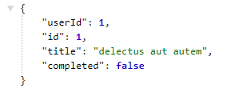
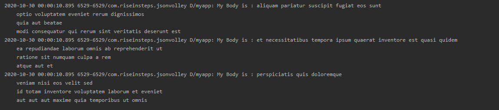

# Introduction

Hi Geeks, I'm sure you may heard about the API's(Application Programming Interface), JSON, why do we use it and how it works? Don't worry if you are new here and don't know so much about these terms. We will introduce you these terms below.

API  is a computing interface which defines interactions between multiple software intermediaries. In other simple words, It defines the kinds of calls or requests that can be made, how to make them, the data formats that should be used, the conventions to follow, etc.

Now talk about JSON, JSON stands for JavaScript Object Notation. JSON is a lightweight format for storing and transporting data. JSON is often used when data is sent from a server to a web page.

In this microbyte, we will going to fetch data from the given URL. URL is taken from the website [FAKEJSON Placeholder](https://jsonplaceholder.typicode.com/). This website allows  you to use fake Online REST API for testing and prototyping with no cose. It is absolutely free.


Reference:<br/>
[API - Application Programming Interface](https://www.mulesoft.com/resources/api/what-is-an-api)<br/>
[JSON - JavaScript Object Notation](https://www.w3schools.com/whatis/whatis_json.asp#:~:text=JSON%20stands%20for%20JavaScript%20Object,server%20to%20a%20web%20page)

# Prerequisites

You need to familiar with JAVA basics and some XML for styling the app.<br/><br/>1. You need to install the JDK(Java Development Kit) and Android Studio on your local machine.

Reference: <br/>
[Installing JDK (Mirror Link 1)](https://www.oracle.com/java/technologies/javase-jdk15-downloads.html)<br/>
[Installing JDK (Mirror Link 2)](https://rb.gy/qvic45)<br/>
[Installing Android Studio](https://rb.gy/6op4ac)

You can replace your "activity_main.xml" and "MainActivity.java" with our "activity_main.xml" and "MainActivity.java" or you can simply copy the code and paste it into your file.

In case if you are not familiar with the Java and XML, you can go through the reference links:

[XML : Building layouts](https://www.youtube.com/watch?v=BWUWJEaI0aE)<br/>
[JAVA Tutorials](https://www.w3schools.com/java/)<br/><br/>2. In this microbyte, we will going to use the "Volley Library" for fetching data over FAKEJSON. Go and search for "Volley library" by going through this [link](https://developer.android.com/training/volley) and explore yourself.


# What will you gain

After contributing in this project, the learner knows:
1. What is API and how do we call it?
2. What is JSON?
3. Use of Volley library and it's predefined methods and object.
4. Fetching data from the given URL.


# Activites

## Activity 1: Allow Permissions and adding dependencies

There are some permissions which would required to fetching the data from the url. You can add permissions in your "AndroidManifest.xml" file. Permissions like Usage of Internet will require to fetching the data.
Now it's time to use Volley Library, you must need to add the dependencies of the library. You can get the library dependencies from [there](https://developer.android.com/training/volley). Don't worry if you don't know how to add the dependencies in android studio. Go through the reference link and explore.<br/>

Reference:<br/>
[Allow Permissions](https://java2blog.com/add-internet-permission-in-androidmanifest-android-studio/)<br/>
[Volley Library](https://stackoverflow.com/questions/16588064/how-do-i-add-a-library-project-to-android-studio)


## Activity 2: Coding Phase in MainActivity.java

This is the coding phase and you would need to code in your "MainActivity.java" fille. Now it's time to fetching data from the given URL, you can take url from [FAKEJSON Placeholder](https://jsonplaceholder.typicode.com/). Before dive into the code, we will want to aware of "Logcat Terminal". Logcat is a command-line tool that dumps a log of system messages, including stack traces when the device throws an error and messages that you have written from your app with the Log class. You are required to use the Logcat Terminal in the android studio to see the response getting from the url you use. Below are the reference links, please go through these reference links to understand more clearly about Logcat Terminal.<br/><br/>

There is some code of "MainActivity.java" file provided to you below where you need to write your own code.

```
    @Override
    protected void onCreate(Bundle savedInstanceState) {
        super.onCreate(savedInstanceState);
        setContentView(R.layout.activity_main);

        RequestQueue requestQueue;
        requestQueue = Volley.newRequestQueue(this);

    // write your code here

    }
```

Screenshot 1: <br/>
<br/>

In this screenshot, there is all the data contain by this [URL](https://jsonplaceholder.typicode.com/todos/1). You are required to fetch this data.

Screenshot 2: <br/>
<br/>

In this screenshot, there is a some response in the "Logcat Terminal". After fetching the data, your response will looks like that. Don't worry, if you feel low. We will provided to you a reference link.

Reference:<br/>
[Volley GET and POST Request(Mirror Link 1)](https://medium.com/techpin/https-medium-com-s2purno-volley-get-and-post-jsonobject-request-46fb8a46f799)<br/>
[Volley GET and POST Request(Mirror Link 2)](https://stackoverflow.com/questions/19837820/volley-jsonobjectrequest-post-request-not-working)<br/>
[Logcat terminal](https://developer.android.com/studio/command-line/logcat)
[How to use the Logcat Terminal for debugging](https://developer.android.com/studio/debug/am-logcat)
<br/><br/><br/>
There are some more screenshots provided to you in the images folder for your convinience.


## Activity 3: Display content to the user's screen

We have always used the "Logcat Terminal" to see the response. What if the response is required to show the details to the user? I mean to say that you was successfully fetching the data and see the response in "Logcat Terminal". Now it's time to show the details to the user by creating a beautiful UI/LAYOUT of the app. There are some reference links which will helps you for sure.<br/><br/>
Reference:<br/>
[How to show the fetching data to the user via TextView](https://developer.android.com/reference/android/widget/TextView)<br/>


### Note that there is no important role of UI/layout of an app. You will always going to use the "Logcat Terminal" to see the response after fetching the data.

# Micro challange

1. Using "Logcat Terminal", you would need to POST fake new data to JsonPlaceholder into the server using https://jsonplaceholder.typicode.com/ . You will using again the "Logcat Terminal" to see the response.<br/><br/>
Reference:<br/>
[How to post data to JSON Placeholder fake server (Mirror Link 1)](https://stackoverflow.com/questions/58535351/how-to-post-data-to-jsonplaceholder-fake-server)<br/>
[How to post data to JSON Placeholder fake server (Mirror Link )](https://medium.com/@pprathameshmore/retrofit-2-simple-get-request-beginner-guide-31c3fdc2affb)

2. Okay, you had successfully fetched data over the FakeJSON via "JSONObjectRequest". Now it's time to do something little different, you will have to fetch the data as an Array over the FakeJSON via "JSONArrayRequest". We will give you the link from where you need to fetch the data from the "JSONArrayRequest". Below are the references which helps you for sure.<br/><br/>
Reference: <br/>
[You will need to fetch the data from this URL](https://jsonplaceholder.typicode.com/posts)<br/>
[How to use JSONArrayRequest method](https://android--examples.blogspot.com/2017/02/android-volley-json-array-request.html)<br/>


## Congrats Dev! You successfully learned how to use API's and fetching data.


# References

1. [Android Documentation](https://developer.android.com/)
2. [Volley library](https://developer.android.com/training/volley)
