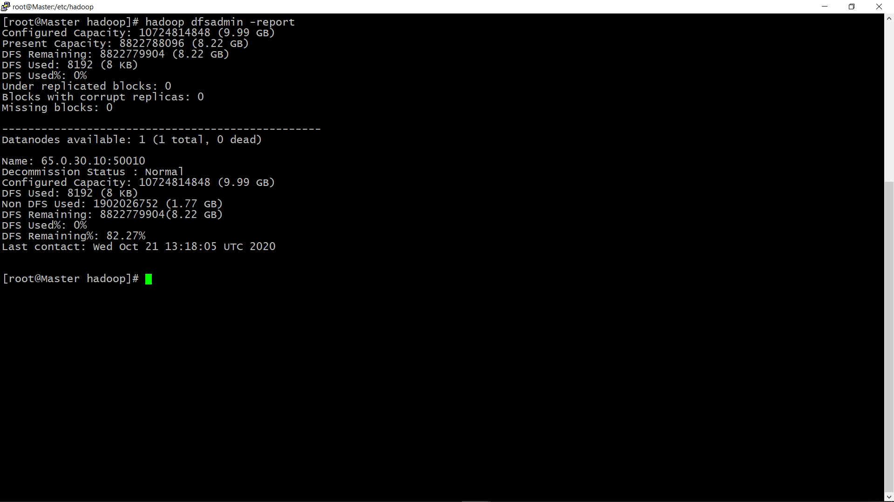
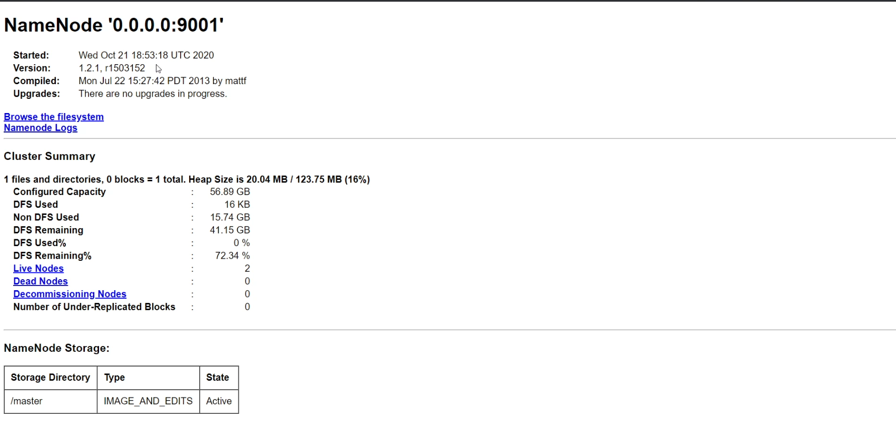

# Introduction

Big data is a huge amount of data and is a problem that everyone is facing in IT industry.Every Seconds huge amount of data is uploaded but their is no such storage that can store this much amount of data.To solve this problem of storing this much amount of data a concept came know as Distributed File Storage(DFS).
What DFS does is, it split the huge data into chunks and then disribute that splitted data into the different servers.
The software that work on the Concept of DFS is **Hadoop**.

In this MicroByte we will be creating a Namenode(Masternode), Datanode(Slavenode) and Clientnode.We will connect Datanode and Client to the Master. When all the nodes are connected to each other they form a cluster kown as Hadoop Cluster and we will perform task on the hadoop cluster.

# Prerequisites

It is preferred that you are aware of Linux basics and AWS.

> Thess files must be downloaded in your system:
 
1. [jdk-8u171-linux-x64.rpm](https://www.oracle.com/java/technologies/javase/javase8-archive-downloads.html)

2. [hadoop-1.2.1-1.x86_64.rpm](https://archive.apache.org/dist/hadoop/core/hadoop-1.2.1/)
 
To install jdk-8u171-linux-x64.rpm :

> Refer to `Images/Prerequisites/jdk_install.png` folder.

To install hadoop-1.2.1-1.x86_64.rpm :

> Refer to `Images/Prerequisites/hadoop_install.png` folder.

### Activity 1: Configure Namenode(masternode)
Launch an intance in aws or open linux terminal.

Download and Install Hadoop and jdk file in your terminal as shown in the Prerequisites of this MicroByte.👆

After installing files we will create a directory in terminal.

> syntax mkdir /directory name

Now we will go inside hadoop directory.

> cd /etc/hadoop

Now see the files inside hadoop directory.

You will find two main files:

- hdfs-site.xml
- core-site.xml

> Refer to `Images/Activities/Activity 1/Activity 1a.png`

**Now we will configure hdfs-site.xml file:

Open hdfs-site.xml using edior.

You can use vi or vim editor in Linux but i will recommend you to use vi editor.

After you open a file you will initially see <configuration>   </configuration> tags.

We have to add code in between these tags.

> Refer to `Images/Activities/Activity 1/Activity 1b.png`

Now follow the steps to configure hdfs-site.xml file :

1. open property tag i.e <property>
2. open name tag and the write `dfs.name.dir`and then close name tag.
3. open value tag an then give the /directory name that you have created above 👆 and then close value tag.
4. Close the property tag.
5. Save the file

> Refer to `Images/Activities/Activity 1/Activity 1c.png`

Hope you have configured the hdfs-site.xml file successfully.

**Activity 1 Task**

Now you have configured the hdfs-sit.xml file, in the same way you have to configure the core-site.xml file.

> Note the little changes that you have do in `core-site.xml file` are:

1. In between name tag write `fs.default.name`
2. In between value tages write `hdfs://0.0.0.0:9001`

Try to search in the internet what these command or code means as it will help you to understand better #LearnByDoing.

Hope you have successfully configured core-sit.xml file.
> In case you face any problem refer to `Images/Activities/Activity 1/Activity 1_Task.png`

### Activity 2: start Namenode service

we have configured our `hdfs-site.xml` and `core-site.xml` file.

Now we will format the directory that we have created in Activity 1.

only for the one time we need to format the directory using command:`hadoop namenode -format`

**Note** We only need to format directory in the master node or Namenode.

> Refer to `Images/Activities/Activity 2/Activity 2a.png`

Now we have to start service by using command:`hadoop-daemon.sh start datanode`.

> Refer to `Images/Activities/Activity 2/Activity 2b.png`

Now we have to check Namenode is succesfully configured or not.

To do that use command `jps` if you see Namenode written after you use command jps, that means Namenode is succesfully created.
 
> Refer to `Images/Activities/Activity 2/Activity 2c.png`

Now we have successfully starte our Masternode/Namenode.

**Activity 2 Task**

Try to find out `why we need to format masternode/namenode directory only for the one time?`

### Activity 3: Configure Slavenode(Datanode)

Launch one more intance in aws or open one more linux os.

Download and Insatll Hadoop and jdk file in your terminal as shown in the Prerequisites of this MicroByte.👆

After installing files we will create a directory in terminal.

**Activity 3 Task **

Configure the files in the same way like we have done in the Activity 1.

> The change that you need to in hdfs-site.xml file:

- In between name tag write `dfs.data.dir`.

> Refer to `Images/Activities/Activity 3/Activity 3a.png`

> The change you need to do in core-site.xml file:

- In between value tags write `hdfs://Ip of the master:9001`. You need to provide masternode Ip.

> Refer to `Images/Activities/Activity 3/Activity 3b.png`

### Activity 4: Start Slavenode(Datanode) service

**Note** We dont need to format the directory in the Datanode

Start the service like we have done in `Activity 2`, only change that we have to do is istead of using namenode in comamnd, we have to use datanode.

> Refer to `Images/Activities/Activity 3/Activity 3c.png`

Now we have to check Datanode is succesfully configured or not.

To do that use command `jps` if you see Datanode written after you use command jps, that means Datanode is succesfully created.

> Refer to `Images/Activities/Activity 3/Activity 3d.png`

**Activity 4 Task**

Create 2 or more Datanodes.

### Activity 5: Check Datanodes are connected to master ot not

To Check we need to use command `hadoop dfsadmin -report`

In my case only 1 Datanode is conaected as i have created only 1 Datanode but `you need to connect 2 or more Datanodes`.

### Activity 6: Create Clientnode

Launch one more intance in aws or open one more linux os.

Download and Insatll Hadoop and jdk file in your terminal as shown in the Prerequisites of this MicroByte.👆

Now we only need to configure is core-site.xml file.We dont need to configure hdfs-site.xml file.

**Activity 6 Task**

Connfigure core-site.xml like you have configured in `Activity 3`.

 Congratulations🎉 we have successfully created a hadoop Cluster.

### Activity 7: Upload and read file in Hadoop Cluster

Now we have formed a Hadoop cluster, now we will upload files to it.

In your Clientnode create a file.

Now use `hadoop fs -put filename /`to upload file.

> Refer to `Images/Activities/Activity 7/Activity 7a.png`

To read a file use command `hadoop fs -cat /filename that  we have uploaded`

### Activity 8: Check file is uploaded or not

There are two ways To check file is uploded or not 
1. using command `hadoop fs -ls /` in nodes
2. Go to your browser and in new tab enter your `Masternode Ip with port number 50070` 

Webui of Hadoop cluster will open form there you can check everything about Hadoop Cluster.

This is how webui of Hadoop Cluster looks like.

 ## SUMMARY
 
 We have creted Datanode,Namenode and client node . we have uploaded data using clientnode and check file is uploaded or not using terminal and webui.

 ## REFERENCES
 
1. [SAS](https://www.sas.com/en_in/insights/big-data/hadoop.html)
2. [databricks](https://databricks.com/glossary/hadoop-cluster#:~:text=A%20Hadoop%20cluster%20is%20a,computations%20on%20big%20data%20sets.)
