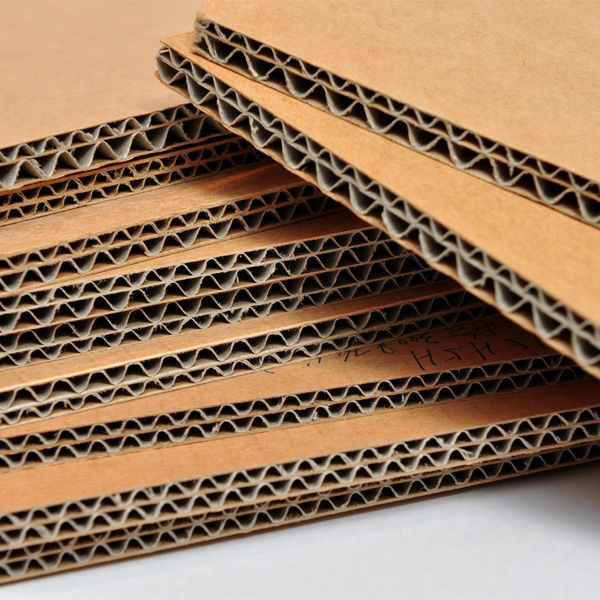
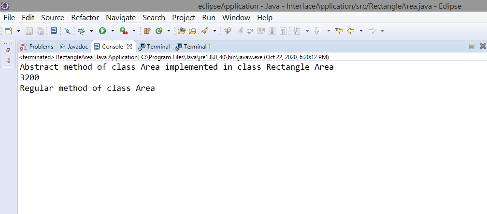
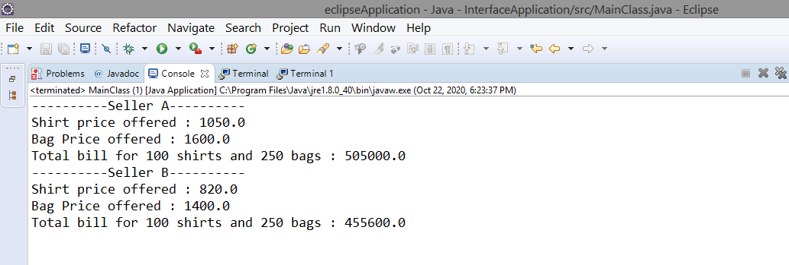
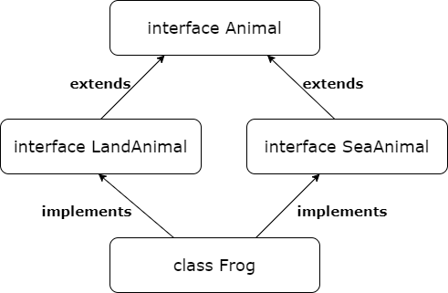

# Introduction
Interface is a shared boundary across which two or more separate components of a computer system exchange information. This exchange can take place between softwares,
hardwares, peripheral devices, humans or a combination of these.  
In Java, interface refers to an abstract type that is used to specify a behaviour that classes must implement. It serves as a blueprint of a class having static constants
and abstract methods. Didn't get it? Let's make things simpler for you with the help of an example:  
Do you remember the corrugated cardboard sheet which is used for preparing cardboard boxes?  
  
The cardboard sheet manufacturing company prepares sheets of different densities and supplies them in some standard sizes to other companies. The boxes of pizza you 
received, box of shoes you bought, the packaging of parcel handed over to you by the delivery guy and the carton of your new AC or fridge, all of them are different 
yet they are made of more or less material of similar properties. All these companies have made cuts, folds, prints etc. on that cardboard sheet according their 
requirements so as to obtain cardboard boxes of desired shapes and sizes. Consider interfaces as those cardboard sheets already having some properties(levels of
corrugation, density, thickness etc.), which are used by the companies to make packaging boxes of different types. But packaging boxes still possess the original
characteristics of that cardboard sheet and are also having their own characteristics like prints, shape, size, brand logo etc.  
  
I hope things are quite clear now, Let's move on to the interesting part of this microbyte- Activities. But before that, please make sure you fulfil all the pre-requisites mentioned.

# Pre-requisites
 * JDK 1.6 or above must be installed
 * Any Java IDE(NetBeans, IntelliJ, Eclipse etc.) must be installed, I prefer Eclipse so if you want you can download it from here:  
   [https://www.eclipse.org/downloads/](https://www.eclipse.org/downloads/)
 * Writing and compiling java code in Eclipse (optional)
 * It would be better, if you have a little bit knowledge of these concepts in Java (You can refer the resources provided in case you don't know about these) -
   * [Classes and Objects](https://www.w3schools.com/java/java_classes.asp)
   * [Inheritance](https://www.guru99.com/java-class-inheritance.html)
   * [Abstraction](https://stackify.com/oop-concept-abstraction/)
   
# Activities
 ## Activity-1 : Understanding Abstract Methods
 Are you familiar with methods in Java? If not, check this out before moving further:  
 [https://www.w3schools.com/java/java_methods.asp](https://www.w3schools.com/java/java_methods.asp)
 ### Abstract Method :
 A method without body (implementation) is called an abstract method. In Java, abstract method looks like-  
 ```Java
      //Notice that keyword 'abstract' and just the method signature is given with a semicolon in the end
      public abstract int calculateArea(int length, int breadth);
```
***Note*** :
* *The class in which abstract methods are defined should be declared as 'abstract'*
* *When a regular class inherits that abstract class, it can provide implementation for that inherited abstract method.*

### Task :
  1) You have to create a class **Area** with 'abstract' keyword and inside that class define two methods: **calculateArea()** and **display()**. Refer this code 
  and utilize the hints provided in the comments there:  
  [Area.java file](https://github.com/srishti-034/Miscellaneous/blob/main/Interfaces_in_Java/code/Activity%201/Area.java)
  2) Next, you have to create another class(in the same package where you created class **Area**) **RectangleArea** which inherits/extends the class **Area**. Within
  this class, implement the abstract method **calculateArea()** and complete the **main()** method according to the hints provided in comments of this file-  
  [RectangleArea.java file](https://github.com/srishti-034/Miscellaneous/blob/main/Interfaces_in_Java/code/Activity%201/RectangleArea.java)  
  3) After writing all the code, save and run the code in java file having class **RectangleArea** i.e. **RectangleArea.java**. And match your output with this:
      

### Takeaways :
Congratulations!! if you have made it so far, you have learnt-
* The concept of ***Method Overriding*** by providing implementation for abstract methods while inheriting them in another class.
* About ***Abstract classes***. Class **Area** that you defined with keyword abstract is an abstract class. It can have abstract as well as regular methods. In fact, 
it is not necessary to have an abstract method inside such class. We cannot create an object of such class but we can inherit it. You can further read about abstract classes here:  
[https://beginnersbook.com/2013/05/java-abstract-class-method/](https://beginnersbook.com/2013/05/java-abstract-class-method/)

 ## Activity-2 : Creating Interfaces in Java
 An interface is a collection of abstract methods (about which we have learnt in the previous activity) and static constants. The syntax of creating an interface is
 quite similar to classes in Java, it looks like-
 ```Java
     interface <interface-name>
     {
          //declare data members which are constant fields.
          //declare methods which are abstract by default
     }
```
By default, methods defined inside an interface are public and abstract. So, it is not required to use keyword **abstract** while defining a method inside
the interface. We can also declare data members in an interface which are public, static and final by default.  

***Note :***
* **Data members in an interface must be initialized** (That's why we call them constants:-) ). These constants can be used in other classes through inheritance.
* We cannot declare constructors inside interface unlike abstract classes
* It is invalid to declare interface as **final**
* Interface is designed to be inherited and it cannot be instantiated (object cannot be created) similar to abstract class.
* Similar to the classes, we have to save the Interface code file in this manner:  ```<interface-name>.java```  

### Task :
1) Create a new interface file in your IDE. Create a public interface **BasePrice**
2) Refer the code in the file mentioned below; declare two constant fields of **float** type and intialize them with the values mentioned in the comments.  
   [BasePrice.java file](https://github.com/srishti-034/Miscellaneous/blob/main/Interfaces_in_Java/code/Activity%202/BasePrice.java)
3) Create three abstract methods in the interface- **calculateShirtPrice()**, **calculateBagPrice()** and **calculateBill()**. For the description of arguments and
return type of the methods, refer the comments in the above code file.  

### Takeaways :
I hope you're enjoying this microbyte. Some of the key takeaways from this activity are:
* Interface structure and syntax
* How are interfaces different from abstract classes?

## Activity-3 : Interfaces and Code Reusability
Well, if you're thinking, what is the use of the interface we have created in the previous activity? Then, let me tell you we are going to create two classes which will
be implementing/inheriting the interface **BasePrice**. Inheritance of interfaces is quite similar to the inheritance of classes but here we use keyword **implements**.  
***Note*** :
* *when a class implements/inherits an interface, **it must override all the abstract methods** of the interface*

### Task :
1) Create a new public class **SellerA** (in the same package where you creted the **BasePrice** interface) which must implement/inherit the interface **BasePrice**
2) Similarly, create another public class **SellerB**(in the same package) which also implements the interface **BasePrice**
3) Refer these code files (SellerA.java and SellerB.java). In both the classes **SellerA** and **SellerB**, you have to implement those three unimplemented(abstract)
methods of the **BasePrice** interface i.e. **calculateShirtPrice()**, **calculateBagPrice()** and **calculateBill()**. Use the hints provided in the comments of these 
code files to implement these methods.  
  * [SellerA.java file](https://github.com/srishti-034/Miscellaneous/blob/main/Interfaces_in_Java/code/Activity%203/SellerA.java)  
  * [SellerB.java file](https://github.com/srishti-034/Miscellaneous/blob/main/Interfaces_in_Java/code/Activity%203/SellerB.java)
4) And the last step is to create another public class **MainClass** which would consist of the **main()** method. Your task is to create objects of the previous classes you've made and call the methods you have created using those objects. Refer this code file for the hints and partially completed **main()** method:  
  [MainClass.java file](https://github.com/srishti-034/Miscellaneous/blob/main/Interfaces_in_Java/code/Activity%203/MainClass.java)
5) You're almost there. Save all your code files and run the **MainClass.java** file. I have provided results for your reference:  
  

*At this point, you may get a question that why we are creating class and overriding the interface methods to provide them a behaviour? Can't we just declare those methods within the class then what is the point of using interface here?*  
This is because:  
- Interfaces help us to achieve 100% **abstraction**,
- They promote **code reusability** and
- They are the real driver of **Polymorphism** in Java  
If you want to have a better understanding regarding the importance and use of interfaces in Java, just go through this article:  
[https://www.java67.com/2014/02/what-is-actual-use-of-interface-in-java.html#:~:text=Interface%20is%20great%20to%20declare,as%20to%20to%20process%20events.](https://www.java67.com/2014/02/what-is-actual-use-of-interface-in-java.html#:~:text=Interface%20is%20great%20to%20declare,as%20to%20to%20process%20events.)
### Takeaways :  
*Congratulations!! you did a great job.* You have successfully created an interface with constants and abstract methods. You have also provided two different implementations for those abstract methods by inheriting the interface and overriding those methods in the child classes. You have also defined two static constants 
and have used them in the methods of the child classes. You have learnt these concepts so far:
* Inheritance of interface (you have practically implemented **hierarchical inheritance** in Java)
* Overriding of interface's abstract methods (you've got a practical example of **Polymorphism** concept :D )  

## Bonus Activity : Diamond Problem and Multiple Inheritance
Are you aware of Multiple Inheritance concept?  
When a class inherits the properties of more than one parent class, such type of inheritance is called multiple inheritance. It's just the opposite of **Hierarchical Intheritance**(one parent, multiple children) that you have just seen. You can perform **Multiple Inheritance** in C++ but it is not allowed in Java because of the **Diamond Problem** which creates ambiguities. Though multiple inheritance is not permitted in Java for classes but it is allowed in case of interfaces. Check this for understanding the Diamond Problem in Java:  
[https://www.javatpoint.com/what-is-diamond-problem-in-java](https://www.javatpoint.com/what-is-diamond-problem-in-java)
***Note*** :
* *When a class inherits an interface we use keyword **implements** but when an interface inherits another interface we use keyword **extends**.*  
### Challenge :
Now it's your time to show some skills. You have to create two interfaces **LandAnimal** and **SeaAnimal** whose parent interface would be **Animal**. These two interfaces would be further inherited by a class **Frog**. Inheritance hirerarchy is shown below:  
  
Now for the implementation part, you're free to do anything. You can experiment with abstract methods by choosing arguments and return type of your choice. And finally provide implementation for the abstract methods in the **Frog** class. Go ahead.  
Happy Coding!!  

# References
* Abstract Methods: [https://beginnersbook.com/2014/01/abstract-method-with-examples-in-java/](https://beginnersbook.com/2014/01/abstract-method-with-examples-in-java/)
* Definition: [https://en.wikipedia.org/wiki/Interface_(Java)](https://en.wikipedia.org/wiki/Interface_(Java))
* [https://www.javatpoint.com/interface-in-java#interfaceex](https://www.javatpoint.com/interface-in-java#interfaceex)
* [https://www.java67.com/2014/02/what-is-actual-use-of-interface-in-java.html#:~:text=Interface%20is%20great%20to%20declare,as%20to%20to%20process%20events.](https://www.java67.com/2014/02/what-is-actual-use-of-interface-in-java.html#:~:text=Interface%20is%20great%20to%20declare,as%20to%20to%20process%20events.)
