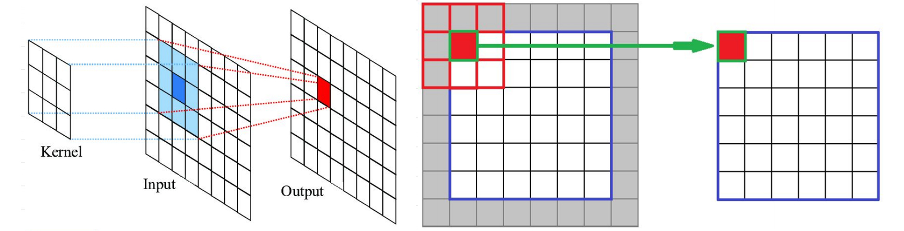
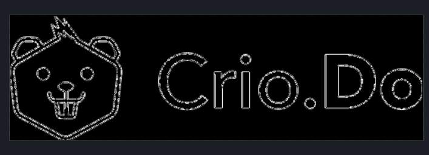

# Learn Building Blocks of Image Processing

## What is in store?

>Entire world can be mapped as a matrix 

Don't trust the above quote? You would have a different perspective by end of this learning. Did you know that all the fancy image filters and effects are all possible with code? This Micro Byte would be a learning experience to know how images are manipulated via code.

## Prerequisite
- Basics of Linear Algebra
- Python

Helpful Python Setup Links
- [Python Installation](https://wiki.python.org/moin/BeginnersGuide/Download) 
- [Install packages from requirements](https://packaging.python.org/tutorials/installing-packages/#requirements-files)
- [Using pipenv](https://pypi.org/project/pipenv/)
## Activity-1: Array from Image

Let us do some activity and learn. We will try to decode an image into an array. We are using the following packages. Install the packages before starting.
- **Numpy** 
- **PIL**

Open the code directory at `src/python`. The file `Activity (1).py` contains the code. Do not be intimidated by the numerous functions, we will learn through activities. 

**Decode Image**
- Modify the function `arrayFromImage()` to use the image from the code directory
- Scroll to the end of the file and call the function

<details>
<summary>Expected Output (click to expand)</summary>

</details>

<details>
<summary>Does the output look like an array? (click to expand)</summary>
What you are seeing is a 2D array representation of the image. Each element in the 2D array represents information about one pixel of the image. Each element of the 2D array pixel in itself is an array. This array represents the colour and transparency information of the pixel. In an RGB(Red Green Blue) image, the first three elements of the array representing the pixel correspond to these colours values and the fourth optional one represents transparency/alpha. 
</details>

<br>
If the above paragraph seems too complicated, recommend you to research a bit on the following topics to get insight

- Colour Channels
- Colour Model
- Colour Hexcode
- RGB(A), CMYK, HSL 

## Activity-2: Create Image with Code

Now that we saw that an image can be decoded into an array, can we create an image of our own from an array? <br>
Open the code directory at `src/python`. The file `Activity (2).py` contains the code. 

**Create Image**
- Modify the function `imageFromArray()` to use valid image names in code
- Scroll to the end of the file and call the function

<details>
<summary>Expected Output (click to expand)</summary>

</details>

<details>
<summary>Does the output image look messy? (click to expand)</summary>
See the code that assigns pixel value in the function. Presently, it is populating with random values. Can you modify the code to fill the entire image with one colour, lets say, yellow.
</details>

**Additional Activity**
- Can you modify the function to create a shape(triangle, circle) instead of one colour throughout the image?
- Can you add some transparency in the image? Hint: Transparency/alpha is the fourth value in the pixel information  

## [Challenge] Activity-3: Convert Image to Greyscale

Greyscale requires just one channel for colour instead of three like RGB. Can you convert the image in `src/python` to greyscale. One of the ways to convert colour to greyscale is to average the values of colours.
Use the `toGreyScale()` in `Activity (3).py` as reference to begin. 

Recommend you to research a bit on the following topics to get an insight about the various greyscale formula.
- Luminance perception
- Linear approximation for greyscale

## References for Kernels and Convolutions

What better way to learn than from the creator of [3Blue1Brown](https://www.3blue1brown.com/), Grant Sanderson teaching at MIT.<br>
Link: https://computationalthinking.mit.edu/Fall20/lecture2/

## Activity-4: Blur with Kernel

An image kernel is a small matrix used to apply effects such as blurring, sharpening or edge-detection to the source image.


**How it works**
- Take a small matrix, and use it step by step to manipulate the image
- Edges are approximated
- Normalise the output

Kernels are normalized to make sure colour values do not overflow the limit.

**Blur Image**
- Modify the function `edgeDetection()` in `Activity (4).py`to use valid image names in code
- Calculate the correct normalization and use it in code.
- Scroll to the end of the file and call the function

<details>
<summary>Expected Output (click to expand)</summary>

</details>

**Challenge Questions**
- Why does for-loop start at 2, instead of 0?
- How would effect change if we use a kernel array of size 3 or size 7?


## [Bonus Challenge] Activity-5: Edge Detection

Edge Detection is done on greyscale image calculating edges for each colour channel has no application presently. Hence, images are converted to greyscale before edge detection.

Can you modify the code in the `edgeDetection()` function in `Activity (5).py`to detect the edges in an image? The present kernel is <br>

```
[[1,0,-1],
[2,0,-2],
[1,0,-1]]
```
This detects an edge in the vertical direction. Run the code to see how it shows

**Challenge Activities**
- Convert image to greyscale and use it.
- Detect horizontal direction edge by using a different kernel
- Can you modify the kernel to detect edges in all the directions?


<details>
<summary>Expected Output (click to expand)</summary>

</details>

**Real-World Application**
Did you know Image Processing has been used in the police department to solve cases? Amazing, isn't it? <br>
Checkout this video: https://youtu.be/-cXBgHgX5UE

**Challenge Questions**
- What happens if you use a kernel array of a larger size?
- What happens if values of kernel array have larger absolute value?(Like replacing 1 and 2 with 4 and 9 respectively)

## What next?
We believe that there can be no one-stop solution to learn it all. And, Image Processing is no exception. It is an advance area of study. For more insight and further learning, few keywords are mentioned below so that you can learn. We do not want to provide a link to a specific article or video for a topic because everyone has a different taste on the type of content that suits them and additionally, we want you to refer to the latest article on the topic whenever you are reading this.

- Noise Removal
- Image Compression
- Super Sampling
- Digital Image Steganography