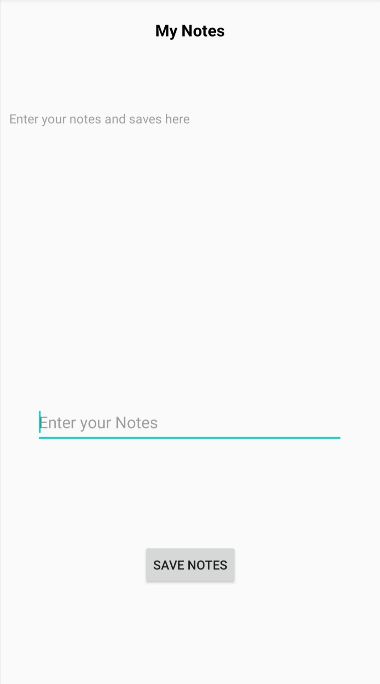

# Introduction

Hello geeks, In this microbyte we will working on the most used app named as "My Notes". You may know some 10-15 years before, our parents was used to make a dairy for saving their contact numbers, expenditures of homes and many others. Today we will working on this type of app. We are not supposed to do adavnced level of coding, we just use the logic and implement the code for saving contact or any other text.

From this microbyte, we will learn how can we make a notes app in which any text is saved and when we restart the app it will show up you the text that you had save recently. We  use "SharedPreferences" to make this app. Don't worry if you don't have knowledge about that, we will give you reference material where it be compulsory.


# Prerequisites

You need to familiar with JAVA basics and some XML for styling the app.

First you need to install the JDK(Java Development Kit) on your local machine from here https://www.oracle.com/java/technologies/javase-jdk15-downloads.html. If you face any problem in installing the JDK, go to youtube there are many tutorials how to install JDK. One of them is https://rb.gy/qvic45. After installing JDK, now you need to install the Android Studio from here: https://rb.gy/6op4ac

When opening the android studio, create a project and you can do follow these steps:

After creating the project, replacing your activity_main.xml and MainActivity.java with our activity_main.xml and MainActivity.java or you can simply copy the code and paste it into your file.
There are some images you need to paste them all in your drawable folder two times, first for drawable and other one for drawable(v24).
In case if you are not familiar with the Java/XML, you can go through the reference links:

[XML : Building layouts](https://classroom.udacity.com/courses/ud834)

[JAVA Tutorials](https://www.w3schools.com/java/)


# Activities

## Activity 1 : Fix Layout
### Note that you need to write your own code in place of TODO comments.

In the "activity_main.xml", you would need to improve the layout of the app. In other words, you would need to write the xml code to improve the layout of the app. After completion of the app, your app's UI looks like the given screenshot.

Reference: https://developer.android.com/guide/topics/ui/declaring-layout

Screenshot: 




## Activity 2 : Coding Phase in the MainActivity.java
### Note that you need to write your own code in place of TODO comments.

In the "MainActivity.java", there are lot of things to do in this file. You need to write your code to save the notes and when the app is restart, your saved data will be retrieved and display in the textview. This can be done with the help of "Shared Preferences". Don't worry if you don't know so much about that, you can take help from the reference link given below.

Reference:  [Shared Preferences](https://www.tutorialspoint.com/android/android_shared_preferences.htm)

```
button.setOnClickListener(new View.OnClickListener(){
            @Override
            public void onClick(View view){
                String msg = editText.getText().toString();

                SharedPreferences sharedPreferences = getSharedPreferences("demo",MODE_PRIVATE);
                SharedPreferences.Editor editor = sharedPreferences.edit();

                //write your code here
            }
        });

SharedPreferences getShared = getSharedPreferences("demo", MODE_PRIVATE);

        //write your code here
```

# References

1. [Android Documentation](https://developer.android.com/)
2. [Button Layout](https://developer.android.com/guide/topics/ui/controls/button)
3. [EditText layout](https://developer.android.com/reference/android/widget/EditText)
