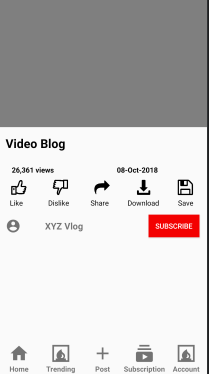

# Introduction

Hello Geeks, We all use Youtube for watching videos for fun, learning etc. In this microbyte, we will going to make the app like youtube but little different. we will just going to make a single activity playing Video.

# Prerequisites

You need to familiar with JAVA basics and some XML for styling the app. 
You need to install the JDK(Java Development Kit) and Android Studio on your local machine.

Reference:  
[Installing JDK 1](https://www.oracle.com/java/technologies/javase-jdk15-downloads.html) 
[Installing JDK 2](https://rb.gy/qvic45) 
[Installing Android Studio](https://rb.gy/6op4ac)

You can replace your "activity_main.xml" and "MainActivity.java" with our "activity_main.xml" and "MainActivity.java" or you can simply copy the code and paste it into your file.

In case if you are not familiar with the Java and XML, you can go through the reference links:

[XML: Building layouts](https://developer.android.com/guide/topics/ui/declaring-layout) 
[JAVA Tutorials](https://www.w3schools.com/java/)

# Activites

### Note that you need to write your own code in place of TODO comments.

1. Please have a look for the screenshot of the app provided to you in the images folder and code the xml to generate the similar layout as given in the screenshot. You would need to write your xml code in "activity_main.xml". Make sure there is no hardcore string/text present in the xml file. You can use "strings.xml" file so that the text value set by you does not become hardcore. Don't worry if you don't have so much knowledge about the xml, we will provided you some references which will help you for sure. I personally suggests you that go through the reference links and explore more about that.

Screenshot: 
 

Reference: https://stackoverflow.com/questions/3263736/playing-a-video-in-videoview-in-android

2. There are many Views and viewsgroup which will required to import and setting their views id's  for their use in the "MainActivity.java" file.

Screenshot: 

Reference: https://www.dev2qa.com/how-to-auto-import-all-class-in-android-studio/

3. This is the coding phase in which you have to code in your "MainActivity.java" file. You would need to code for the VideoView, calling their id's, setting the video path, etc. After to do that, You would also required to add the media controllers and attatched to the "VideoView". 

There is the clip provided to you in the screenshot folder which resides in images folder for your convinience.

Below is the reference link which helps you to give an idea of how "VideoView" works.  
Reference:  
[VideoView Documentation](https://developer.android.com/reference/android/widget/VideoView) 
[How VideoView works](https://stackoverflow.com/questions/3263736/playing-a-video-in-videoview-in-android)

### To run this app into your device, Go through the following steps below:
Go to menu bar, Build -> Build Bundle(s)/ APK(s) -> Build APK(s).

## Congrats Dev! You successfully created a Video Player Application.

# Micro challange

1. After successfully creating the app, there is small micro challenge for you. The challenge is that you just add one more video clip and see how it works.
2. This is the second and the last micro challenge, You would need to improve the layout of the app not like youtube. It is from your creative ideas and improves for the better layout.

# References

1. [Android Documentation](https://developer.android.com/)
2. [VideoView Documentation](https://developer.android.com/reference/android/widget/VideoView)
